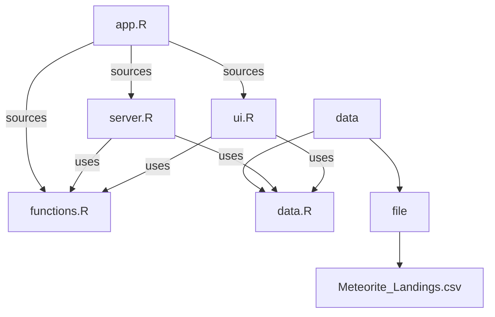
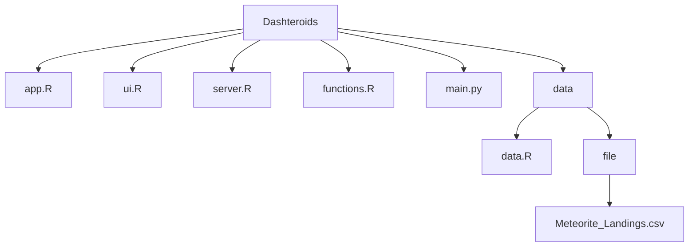

# DashteRoids :comet:


Welcome to DashteRoids, your comprehensive dashboard for visualizing and analyzing meteorite landing data. This tool is designed to provide insightful analytics through interactive charts and maps. **It can be used with or without an internet connection**.

## User Guide :book:
### Prerequisites

Before you begin, make sure you have the following prerequisites installed:

- **R**: Make sure you have R installed on your machine. DashteRoids relies on R for its backend logic.
- **Shiny**: A web application framework for R, which is essential for running the interactive dashboard.

### Tech Stack
DashteRoids is built using a few powerful technologies:
- **R**: For server-side logic and running the Shiny app.
- **Shiny**: A web application framework for R, making it easy to create interactive, web-based data visualizations.

### How to Use
#### Install
##### Using RStudio
1. **Clone the Repository**: Get a copy of the source code on your local machine. You can run this command in RStudio
```bash
devtools::install_github("https://github.com/WhiteWall13/DashteRoids---R")
```
2. **Run the App**: Open the app.R file and click the "Run App" button. You can also run this command.
```bash
shiny::runApp(port = 8080)
```
3. **Access the Dashboard**: Open your preferred web browser and visit http://localhost:8080 (or the port you specified) to start exploring the data.

##### Using command lines
1. **Clone the Repository**: Get a copy of the source code on your local machine. You can run this command in your terminal.
```bash
git clone https://github.com/WhiteWall13/DashteRoids---R
```
2. **Navigate to the Project Directory**: Open a terminal and navigate to the project directory.
```bash
cd DashteRoids---R
```
3. Run the App: Execute the following commands.
```bash
R -e "shiny::runApp('app', port = 8080)"
```
4. **Access the Dashboard**: Open your preferred web browser and visit http://localhost:8080 (or the port you specified) to start exploring the data.

##### Additional Notes
- Ensure that the required R packages are installed by following any installation instructions provided in the repository.
- If you encounter any issues, feel free to contact me.

## Data Analyze :bar_chart:
This [dataset](https://data.nasa.gov/Space-Science/Meteorite-Landings/gh4g-9sfh), curated by Javier de la Torre and The Meteoritical Society, offers a detailed record of meteorite landings, capturing each meteorite's location, type, mass, and discovery. Spanning diverse fields from geographical coordinates to meteorite classifications, it provides both a chronological and categorical view of these celestial events. The [dataset](https://data.nasa.gov/Space-Science/Meteorite-Landings/gh4g-9sfh) distinguishes between 'valid' and 'relict' meteorites, highlighting the interaction between these space objects and Earth's environment. Significantly, post-1969, the year of the first Moon landing, marks an era of increased meteorite documentation, reflecting a surge in space exploration interest. This [dataset](https://data.nasa.gov/Space-Science/Meteorite-Landings/gh4g-9sfh) not only traces the scientific journey of meteorite discovery but also reflects humanity's evolving curiosity in space.

### Exploration of the Meteorite Landings Dataset: A Datatable
Our first visualization offers an interactive datatable, providing a direct and detailed view of the meteorite landings data. This table is designed to facilitate an initial, in-depth exploration of the [dataset](https://data.nasa.gov/Space-Science/Meteorite-Landings/gh4g-9sfh), showcasing the raw data in its most granular form (I just transformed the year data from a timestamp format to an integer format. This modification enhances the readability and usability of the data). This datatable is an excellent starting point for anyone interested in delving into the world of meteorite landings.

### Analysis of Predominant Meteorite Classes in the Dataset : A pie chart
The [dataset](https://data.nasa.gov/Space-Science/Meteorite-Landings/gh4g-9sfh) reveals a significant distribution of meteorite classes, predominantly featuring various types of chondrites and their subcategories. Here's an analysis of why these particular groups are more commonly found:

#### Chondrites (L and H Classes)
L (Low iron) and H (High iron) Chondrites: These are among the most common types of meteorites. L chondrites have low iron/nickel metal content, while H chondrites have a higher metal content. Their abundance in the [dataset](https://data.nasa.gov/Space-Science/Meteorite-Landings/gh4g-9sfh) reflects their frequent occurrence in meteorite falls on Earth.
LL (Low metal, Low iron) Chondrites: This subgroup of chondrites has even lower metal content. They are less common than L and H types but still significant in number.
#### Petrologic Types (Numbered Suffixes)
Degrees of Thermal Alteration: The numbers in the classification (e.g., L4, H5) indicate the degree of thermal alteration or metamorphism the meteorite has undergone. Higher numbers suggest more extensive thermal metamorphism, likely from heating events during their space journey or upon entry into Earth's atmosphere.
#### Scientific and Collection Bias
Detection and Collection: More common types, like certain chondrites, are often easier to find and identify due to their size, magnetic properties, and distinctive appearance, leading to higher representation in collections.
Scientific Interest: Some classes may be more represented due to focused scientific interest, leading to more active collection and cataloging efforts.
#### Conclusion
The predominance of certain chondrite classes in the [dataset](https://data.nasa.gov/Space-Science/Meteorite-Landings/gh4g-9sfh) reflects both their natural abundance in meteoritic falls and the influence of collection and classification practices. These meteorites offer valuable insights into the early solar system and the dynamic processes that bring these celestial objects to Earth.

### Analysis of Meteorite Landings Over Time : Histogram and Line Chart
- The data shows a significant increase in the number of meteorite landings recorded starting around the 1970s. This coincides with the era of the first human landing on the Moon in 1969, which greatly heightened public and scientific interest in space exploration and celestial phenomena. Advancements in technology and scientific methodologies during this period made the detection and recording of meteorite landings more efficient and widespread.
- In earlier times, many meteorite landings likely went unrecorded or unrecognized due to the inability to distinguish them from terrestrial objects. Without modern scientific knowledge and tools, identifying meteorites was a significant challenge. Also, over time, meteorites can become weathered, buried, or otherwise altered, making them harder to identify and catalog. This natural process means that older meteorites are less likely to be found and recorded.

### Analysis of Meteorite Findings by Continent : Bar Chart
The bar chart depicting meteorite findings across different continents reveals some fascinating geographical trends. Here's an expanded analysis of why certain continents show higher numbers:

#### Antarctica

- Ideal Preservation Conditions: Antarctica's ice and snow provide a stark background against which dark meteorites can be easily spotted. Additionally, the cold environment helps preserve the meteorites in almost pristine condition.
- Concentrated Efforts: Scientific expeditions specifically aimed at recovering meteorites are more common in Antarctica, contributing to the high number of findings.

#### Africa

- Desert Environments: Large desert areas, like the Sahara, offer similar visibility advantages as Antarctica. Meteorites are easier to spot against the sandy background and are less likely to be obscured by vegetation or human activity.
- Size and Exploration: Africa's vast land area and the increasing efforts in scientific exploration in desert regions contribute to the high number of meteorite recoveries.

#### Asia and North America

- Population Density and Accessibility: In more densely populated or vegetated areas, meteorites are harder to find. Additionally, accessibility for scientific exploration can be limited in certain regions.
- Reporting and Collection Practices: Cultural factors and the presence of established scientific communities can influence how many meteorites are reported and collected.

#### South America, Oceania, and Europe

- Geographical and Climatic Factors: The lower numbers in these continents could be due to a combination of factors like smaller land areas (in the case of Europe and Oceania), denser vegetation, and different climatic conditions that make meteorite discovery and preservation more challenging.
- Historical and Cultural Context: The history of scientific exploration and the level of interest in meteoritics can vary significantly, impacting the number of meteorites found and reported.

#### Conclusion
The distribution of meteorite findings across continents is influenced by a complex interplay of environmental, geographical, and human factors. Antarctica and Africa lead in numbers due to their favorable conditions for meteorite preservation and discovery, as well as concentrated scientific efforts. In contrast, factors like population density, vegetation cover, and the extent of scientific exploration play significant roles in the lower numbers observed in other continents. This distribution underscores the importance of environmental and human elements in the discovery and study of meteorites.

### Population Density and Technological Advancement: A Map

The final visualization in the [dataset](https://data.nasa.gov/Space-Science/Meteorite-Landings/gh4g-9sfh) is a map showing the points of recorded asteroid landings and a corresponding density map. This map reveals distinct patterns in asteroid discovery, which can be attributed to several factors:

#### Depending to the population
- Higher Discoveries in Populated Areas: The map shows a higher concentration of asteroid discoveries in technologically advanced and densely populated regions. This is likely due to the increased likelihood of human observation and reporting in these areas.
- Technological Resources: Advanced technological capabilities, including better detection equipment and more robust scientific infrastructure, contribute to more frequent discoveries in developed regions.
- Cultural and Scientific Factors: The level of interest in astronomy and space science, as well as the cultural importance placed on such discoveries, can vary by region, influencing the number of reported findings.

#### Geographical and Environmental Factors

- Land vs. Water: It's notable that there are very few, if any, asteroid discoveries in large bodies of water. This is expected, as oceans cover a vast majority of the Earth's surface, yet they are largely unmonitored for such events due to the logistical challenges and the lack of permanent human presence.
- Visibility and Accessibility: In remote or densely vegetated areas, asteroid discoveries are less common. This is due to both the difficulty in spotting these objects and the challenges in accessing these locations for verification and study.

#### Conclusion

The asteroid discovery points and density map provide a compelling visualization of where asteroid landings have been recorded. The distribution is heavily influenced by human factors such as population density, technological advancement, and scientific interest, as well as by geographical and environmental considerations. This map underscores the interplay between human observation, technological capabilities, and natural occurrences in the documentation of celestial events.

### Synthesis of Meteorite Landings Data Analysis 
The Meteorite Landings [dataset](https://data.nasa.gov/Space-Science/Meteorite-Landings/gh4g-9sfh) offers a unique window into the history of celestial encounters with Earth, enriched by diverse data ranging from geographical locations to meteorite classifications. Key insights include the predominance of certain meteorite classes, reflecting both natural abundance and scientific collection biases. The temporal distribution of meteorite landings, particularly the surge post-1969, highlights the impact of technological advancements and growing scientific interest. Geographical trends in discoveries underscore the interplay of environmental conditions, human factors and technological factors, with notable concentrations in regions like Antarctica and Africa. This [dataset](https://data.nasa.gov/Space-Science/Meteorite-Landings/gh4g-9sfh) not only charts the physical journey of these space travelers but also encapsulates humanity's evolving curiosity and engagement with the cosmos.

## Developper guide :technologist:

After successfully launching the Dashteroids dashboard, you may be curious about the underlying code and architecture. This section provides a detailed walkthrough of the codebase, making it easier for developers to navigate and understand the project.

This guide provides an overview of the DashteRoids - R Shiny application's codebase. It is intended to help developers understand the architecture and main components of the application.

### Application Structure
The application is organized into several key files and directories:

- `DashteRoids---R.Rproj`
- `README.md`
- `app.R`
- `data/`
    - `data.R`
    - `file/`
        - `Meteorite_Landings.csv`
- `functions.R`
- `server.R`
- `ui.R`

Code Structure Diagram





### Detailed Overview
#### `app.R`
This is the entry point of the Shiny application. It sources the functions.R, server.R, and ui.R scripts and initializes the Shiny app with shinyApp(ui = ui, server = server).

#### `data/`
This directory contains the data.R script for data preprocessing and the Meteorite_Landings.csv dataset. The data.R script is responsible for loading and preparing the data for use in the app.

#### `functions.R`
Contains utility functions used across the application, including install_if_missing for package management and coords2continent for geographical data processing.

#### `server.R`
Defines the server logic of the Shiny application. It includes the reactive elements and data processing required for the app's functionality.

#### `ui.R`
Contains the user interface definition for the Shiny application. It uses shinydashboard to create a dashboard layout and plotly for interactive visualizations.


### Code Details
#### Data Handling
The `data.R` script is crucial for data preprocessing. It reads the `Meteorite_Landings.csv` file and performs necessary transformations to prepare the data for visualization and analysis.

#### User Interface
The `ui.R` script uses shinydashboard to create a structured and interactive dashboard. It defines various UI components like sliders, dropdowns, and plot outputs.

#### Server Logic
In `server.R`, reactive expressions and observers are used to handle user inputs and update the UI accordingly. It includes the logic for generating plots and tables based on user selections.

#### Utility Functions
`functions.R` includes functions that are reused in multiple parts of the application, enhancing code reusability and reducing redundancy.

## Author ✍️
#### Nicolas Hameau  
-  [nicolas.hameau@edu.esiee.fr](mailto:nicolas.hameau@edu.esiee.fr)
-  [Nicolas Hameau](http://linkedin.com/in/nicolas-hameau-13242002)
-  [WhiteWall13](https://github.com/WhiteWall13)


